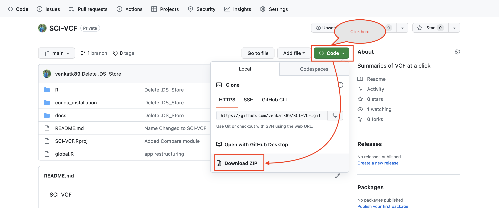

# Installation for personal use


SCI-VCF can be installed locally, in multiple ways!

## Online access

Step 1:  Open the [SCI-VCF](https://ibse.shinyapps.io/sci-vcf-online/) website.


*Note: Online version of SCI-VCF comes with upload size limitations. To get the full functionalities of SCI-VCF, use a local/server installation of the tool.*


## RStudio based installation

### Prerequisites

+ R (version > 4.2.3) <a href="https://www.r-project.org/" target="_blank">(link)</a>
+ RStudio <a href="https://posit.co/products/open-source/rstudio/" target="_blank">(link)</a>
 
### Procedure

**Step 1: Get the SCI-VCF repository from GitHub.** 

You can download the zipped version of the repo at this <a href="https://github.com/HimanshuLab/SCI-VCF" target="_blank">link</a>



**Step 2: Extract the files in your computer.** 

This will create a foler in you computer called SCI-VCF-main. Open that folder.


**Step 3: Launch SCI-VCF**

Open the folder named ```R```. Open ```global.R``` with RStudio and click the ```Run App``` button.


*Note: The first time you launch SCI-VCF by clicking the ```Run App``` button, some dependencies will be downloaded. Kindly wait till then. You need to be connected to the internet and might need to give authorization if required. Once the dependencies are installed, SCI-VCF can be used offline thereafter.*

<br>

## Conda based installation


### Prerequisites

+ Conda <a href="https://docs.conda.io/projects/conda/en/latest/user-guide/install/index.html#regular-installation" target="_blank">(link)</a>
+ Command Line Interface

### Procedure

**Step 1: Get the SCI-VCF repository from GitHub**
```
git clone https://github.com/HimanshuLab/SCI-VCF
```

**Step 2: Open the SCI-VCF directory**
```
cd SCI-VCF
```

**Step 3: Create the conda environment with all required dependencies** 
```
conda env create -f conda/SCI-VCF_conda_env.yaml
```

**Step 4: Activate the conda environment created**
```
conda activate SCI-VCF
```

**Step 5: Open ```global.R``` from the ```R``` directory in RStudio**
```
rstudio R/global.R
```

Step 5: Launch SCI-VCF by clicking the ```Run App``` button.


*Note: For conda-based installation in Windoas OS, we recommend using the Windows Subsystem for Linux. More information is available in the [FAQ](faq.md) section.*

## Docker based installation

### Prerequisites

+ Docker <a href="https://docs.docker.com/get-docker/" target="_blank">(link)</a>.
+ Web Browser
+ Sudo privelleges

**Step 1: Get the SCI-VCF image from Docker Hub and run it**
```
sudo docker run -it --rm -p 3000:3000 venkatk89/sci-vcf
```

**Step 2: Open SCI-VCF via browser using the address below:**

> http://0.0.0.0:3000/


*Note: The docker command in step 1 is to run the container interactively, which makes SCI-VCF inactive when the terminal is exited. Docker containers can also be run detached from the terminal as a backend job. When the docker image is run this way, SCI-VCF will always stay active at the link mentioned in Step 2. More information is available in the [FAQ](faq.md) section.*